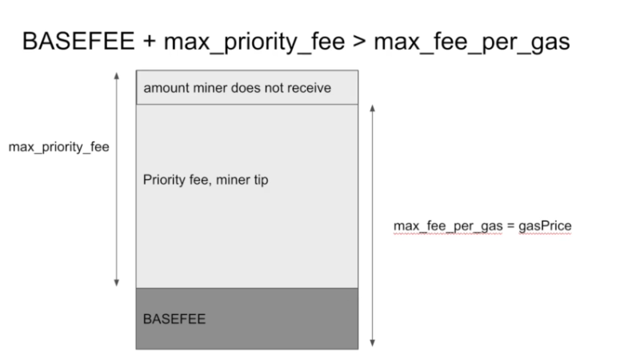

# Gas Costs

- Transaction cost: 21k gas
- Storage load: 2.1k gas

## Block Gas Limit

Throughput - transactions per second. ~30 million gas per block.
Tornado Cash is ~1m gas per transaction - so 30 transactions per block - 2.5 transactions per second.
Ethereum transfers are 21k gas - so 1428 transactions per block - 119 transactions per second.

## Sneaky gas costs

- Op codes - however much
- Tx cost - 21000
- tx.data - depends on how much data is in the transaction

## 5 ways to save gas

- On deployment - smaller contract - less paid on deployment
- During computation - fewer or cheaper opcodes
- Transaction data - the less transaction data, (the less non-zero bytes in it) the less the gas cost
- Storage - the less storage you use, the less gas you pay

## EIP-1559

Before this, all the gas went to miners.

- tldr: gas price per gwei <= max_fee
  - difference between these two are refunded to you

- `max_fee_per_gas`
  - most gwei you are willing to pay per gas (independent of `max_priority_fee_per_gas`)
- `max_priority_fee_per_gas`
  - what portion of the max_fee_per_gas you want to be a miner tip
  - this is a subset of `max_fee_per_gas`
  - how much the miner might receive
- `BASEFEE`
  - set at the protocol-level 
  - this amount is definitely going to be burnt

### BASEFEE

Determined at the protocol level as number of gwei per gas to be burnt in a transaction.

- Roughly increases by 12% if the last block was full, and decreases by 12% if the last block was empty
  - Exact formula more complicated
  - Solidity `^0.8.7` `block.basefee`

### Max Base Fee

- For a transaction to go through, `max fee >= BASEFEE`
- as `BASEFEE` changes every block, you need to leave some wiggle room when sending a tx.

### Priority Fee

- Max priority fee = max priority fee you specify in the transaction
  - most you are willing to give to the miner out of what is left when the max fee for gas is subtracted from the base fee
- priority fee = amount miner actually receives. Also known as miner tip

```
Max Fee - BAASEFEE = leftover
case1: max_priority_fee < leftover: leftover - max_priority_fee = refund
case2: max_priority_fee >= leftover: 0 refund, miner gets leftover

if max_priority_fee > leftover -> refund = 0
  tx fee = BASEFEE + (max_fee - max_priority_fee)
  tx fee = BASEFEE - miner tip
if max_priority_fee < leftover => refund > 0
  tx fee = burned fee (basefee) + max_priority_fee
```




### Example Zero

- BASEFEE = x
- max_fee_per_gas = 90
- max_priority_fee_per_gas = 100
- This is invalid because max_priority_fee_per_gas > max_fee_per_gas

### Example 1

- BASEFEE = 0 (this would never actually happen, but imagine)
- max_fee_per_gas = 3
- max_priority_fee_per_gas = 3
- You pay 3 gwei per gas
- The miner receives 3 gwei per gas
- No ether is burned

### Example 2

- BASEFEE = 70
- max_fee_per_gas = 90
- max_priority_fee_per_gas = 50
- 70 gwei per gas is burned
- 20 gwei per gas goes to the miner
- The miner cannot receive 50 gwei per gas unless the BASEFEE had dropped to 40

### Example 2b

- BASEFEE = 70
- max_fee_per_gas = 90
- max_priority_fee_per_gas = 15
- 70 gwei per gas is burned
- 15 gwei per gas goes to the miner
- 5 gwei per gas is refunded

### Example 3

- BASEFEE = 90
- max_fee_per_gas = 90
- max_priority_fee_per_gas = 90
- Miners will probably not accept this transaction as it contains no tip

## Conclusion

- BASEFEE - amount burned. This is determined by the network
- Max Fee - most you are willing to pay for the transaction in total
- Max Priority Fee - most you are willing to give to the miner
- Miner tip / priority fee - the amount the miner actually receives
  - The miner receives less than the max priority fee if max_fee - BASEFEE < max_priority_fee
