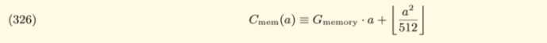

# Memory Gas Costs

## Memory vs Calldata

If memory passed in as part of a function call, calldata is cheaper. If memory is used it has to be copied from calldata to memory.

You will have to use memory though if you need to mutate the data.

It is more efficient to pass in via memory in the function signature if you are going to mutate the data.

## Memory Explosion

Memory is relatively cheap to allocate as long as it small.

However we do see quadratic growth in the cost of memory allocations at high levels:

i.e. gas cost for different length memory array creation:
- 10 - 342
- 20 - 403 - linear increase
- 30 - 464 - linear increase
- 1000 - 8,250 - linear increase
- 10k - 0.25m
- 20k - 1m - quadratic increase
- 200k - beyond gas limit due to block limit

## Clearing Memory

In Solidity memory is never cleared. Go, JS & Python has a garbage collector. C & C++ you must manually deallocate memory. Rust has a compiler that does it for you using borrowing.

Be very careful when you allocate memory over and over, the costs will keep adding up and possibly enter the quadratic growth region.
