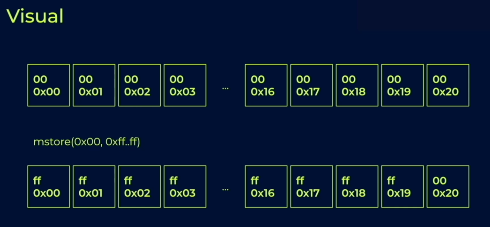
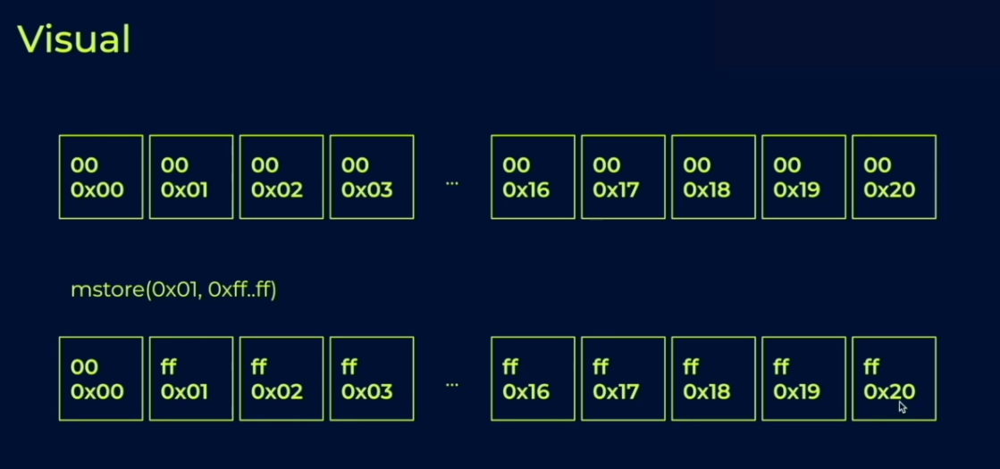
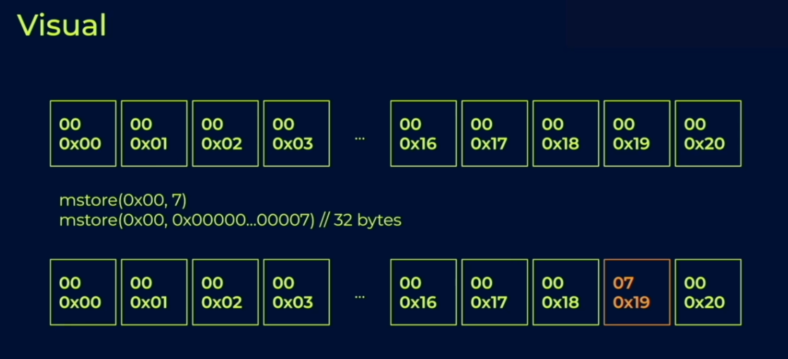
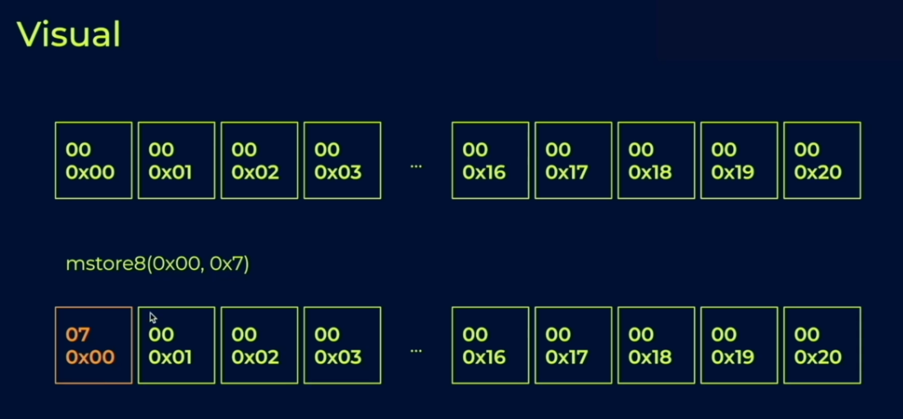

# Memory

## Memory is a prerequisite

- You need memory to do the following
  - Return values to external calls
  - Set the function arguments for external calls
  - Get values from external calls
  - Revert with an error string
  - Log messages
  - Create other smart contracts
  - Use the keccak256 hash function

## Overview

- Equivalent to the heap in other languages
  - But there is no garbage collector or `free`
  - Solidity memory is laid out in 32 byte sequences
  - [0x00 - 0x20] [0x20 - 0x40] [0x40 - 0x60] ...
- Only four instructions: `mload`, `mstore`, `mstore8`, `msize`
- In pure yul programs, memory is easy to use. But in mixed solidity/yul programs, solidity expects memory to be used in a specific manner

- **Important:** You are charged gas for each memory access, and for how far into the memory array you accessed.
- `mload(0xffffffffffffffff)` will run out of gas. Demo!
  - Using a hash function to `mstore` like storage does is a bad idea!
- `mstore(p, v)` stores value v in slot p (just like sload)
- `mload(p)` retrieves 32 bytes from slot p [p..0x20]
- `mstore8(p, v)` like mstore but for 1 bytes
- `msize()` largest accessed memory index in that transaction

## How Solidity Uses Memory

